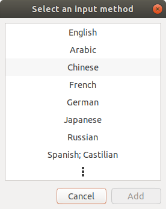

# 在 Ubuntu 18.04.1 的 IBus 上安裝大易輸入法

### 下載安裝腳本
```
$ wget https://raw.githubusercontent.com/Alger23/ubuntu_dayi_for_ibus/master/dayisetup.sh
```

### 下載大易三碼字根檔
```
$ wget https://raw.githubusercontent.com/Alger23/ubuntu_dayi_for_ibus/master/dayi3.cin
```

### 執行安裝腳本
```
$ chmod u+x dayisetup.sh
$ sudo ./dayisetup.sh
```

### ibus 設定大易輸入法

```
$ ibus-setup
```

* 經由 ibus-setup 指令開啟的 ibus 設定畫面


* 切換到 Input Method 頁籤


* 選取 Chinese



* 選取 dayi，按下 【Add】


* 選取 Chinese-dayi ，設定【Preferences】


* 將 Chinese mode: 設定為 Traditional Chinese，按下【Close】


* IBus Preferences 畫面再按下【Close】，完成 ibus 的大易輸入法設定

* 右上角的小工具，展開，選擇設定(Settings)。


* 選取區域和語言(Region & Language)，在輸入來源(Input Sources)點選「加號」


* 選擇輸入來源為「Chinese (Taiwan)」

(images/dayi/090_region-language-select-chinese-taiwan.png)

* 選擇 Chinese (dayi)，然後按下【Add】

(images/dayi/100_region-language-add-dayi.png)

* 此時可以在 Input Sources 的區域看到新加入的大易輸入法「Chinese (dayi)」，關閉此視窗

(images/dayi/110_region-language-close.png)

* 在右上角的輸入法已經能切換至大易輸入法了

(images/dayi/120_region-language-dayi-done.png)

